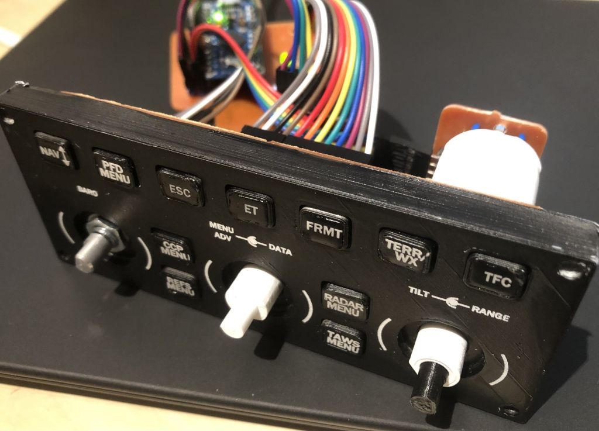
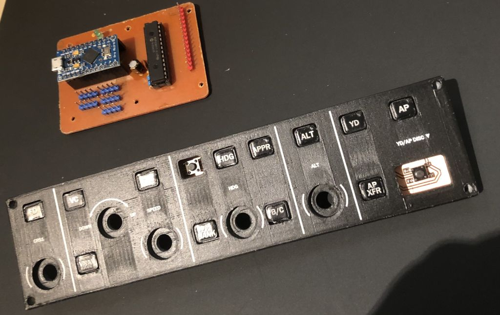
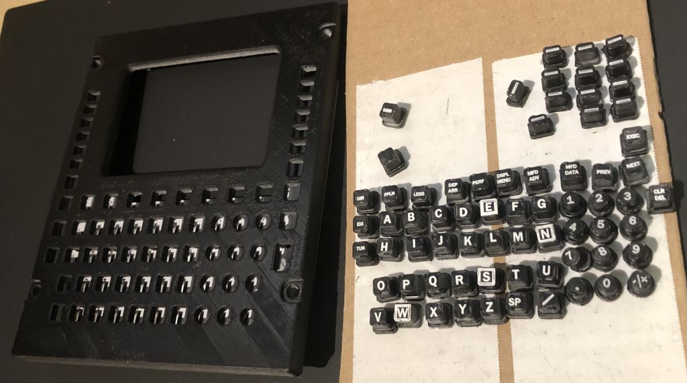
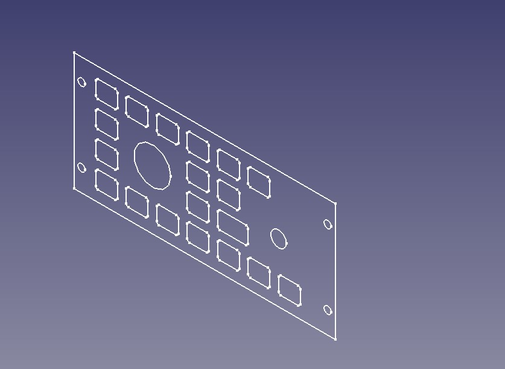

# CJ4 Panels

CJ4 Panels are designed to enable an avgeek to build their own Control Panels for [CJ4 Working Tilte Mod](https://github.com/Working-Title-MSFS-Mods/fspackages) for MS Flight Simulator 2020.
Those consist of:

* Eagle files for PCBs (orderable or to be made on a CNC-mill)
* List of electronic components
* STL files for 3d printing
* Inkscape SVG files for laser engraving
* Arduino firmware
* FSUIPC Configuration

Those additionally use certain components from [FlightSimMaker](https://www.thingiverse.com/flightsimmaker/designs) excelent G1000 project - namely [push button switches](https://www.thingiverse.com/thing:4019943) and [Dual Concentric Rotary Encoders](https://www.thingiverse.com/thing:4373531).

## Folder layout

Each panel and component has its own folder. Inside that folder you will find relevant files sorted by type - Eagle, STL etc.
If a certain component requires extra information it will have its own README.MD file.

## Available Panels:

### Primary Flight Display / Display Control Panel

Using a single Arduino/Sparkfun Pro Micro it presents itself to MSFS as a 26 button joystick.

 <span style="display:block;text-align:center"></span>

## Coming Soon:

### Autopilot / Flight Guindance Panel

Using a single Arduino/Sparkfun Pro Micro it presents itself to MSFS as a 29 button joystick.

 <span style="display:block;text-align:center"></span>

### Flight Management System (Computer) / Multi-Function Control and Display Unit

Using a single Arudino/Sparkfun Pro Micro and the MMJoy2 interface it presents itself as a 96+ button joystick.

 <span style="display:block;text-align:center"></span>

### Multi Function Display / Cursor Control Panel

 <span style="display:block;text-align:center"></span>

## Requirements

* MS Flight Simulator *(I tested it on Steam version)*
* FSUIPC v7 paid version - [link](https://secure.simmarket.com/john-dowson-fsuipc7-for-msfs.phtml)
* MobiFlight WASM module - [link](https://www.mobiflight.com/en/index.html)
* Arduino IDE v1.8.5 or higher - [link](https://www.arduino.cc/)
* Libraries:
	* [Common Bus Encoders](https://github.com/j-bellavance/CommonBusEncoders)
	* Joystick library - available via Manage Libraries in Arduino IDE
	* Adafruit MCP230177 library - available via Manage Libraries in Arduino IDE
* Arduino Pro Micro (based on Atmega32u4) *This is very important! Other AVR chips WILL **NOT** work*

## Building the physical part of the panels

### 3d Printing

Coming soon...

### Laser engraving

Coming soon...

### Making PCBs

Coming soon...

## Installation

#### Installing the software
1. If you have not done so, purchase and install FSUIPC v7
2. Download and install MobiFlight. You do not need to actually be running this software - you just need it's WASM module. Install it in accordance to MobiFlight instructions.
3. Download and install Arduino IDE
* Install required libraries
* If you are using the SparkFun Pro Micro or its clone - Install the proper AVR boards definitions to Arduino Board Manager \([tutorial](https://learn.sparkfun.com/tutorials/installing-arduino-ide/board-add-ons-with-arduino-board-manager)\)

#### Setting up the software:

FSUIPC:
* Copy files from FSUIPC_Configuration folder to your FSUIPC installation folder
* Edit FSUIPC.ini file and modify two lines:
```
[General]
UseProfiles=Files
```
AND
```
[Buttons]
PollInterval=10
```
It is possible that your Arduino Pro Micro joystick will register at a different letter. If that happens you can either:
* Edit the FSUIPC.ini file and change letter assignments in section \[JoyNames\], or
* Edit the Profile files and change letter assignments for each control: For example if you change from Joystick D to F you need to change every occurrence of **PD** to **PF**

#### MS Flight Simulator Setup

At current stage of simulator development no setup is necessary. It is all handled by FSUIPC & MobiFlight combination.

## Usage

Just use like would any joystick controller!

## Contributing

If you find a bug or have a question, feel free to message me on github or to open an Issue.

## Acknowledgments

Many thanks to wonderful people at FlightSimMaker group discord server as well as to all authors who have provided libraries and freeware software available for flightsimmers worldwide

## Questions / Contact

Just drop me an email at swidzi@gmail.com

### License
[GNU GPLv3](https://choosealicense.com/licenses/gpl-3.0/)